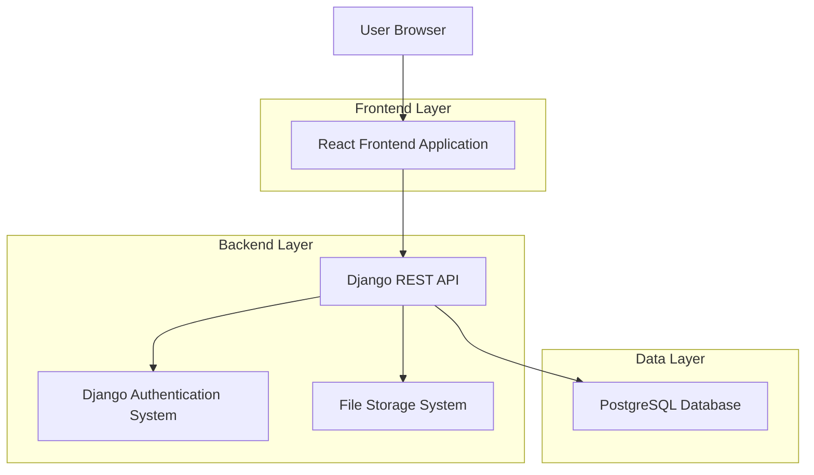
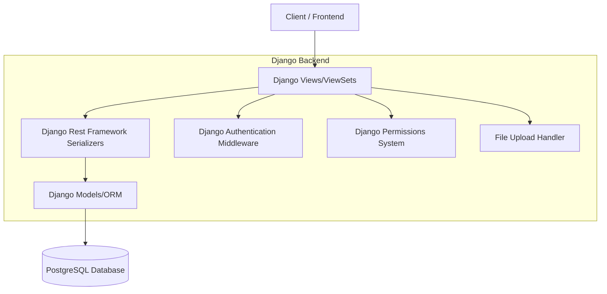
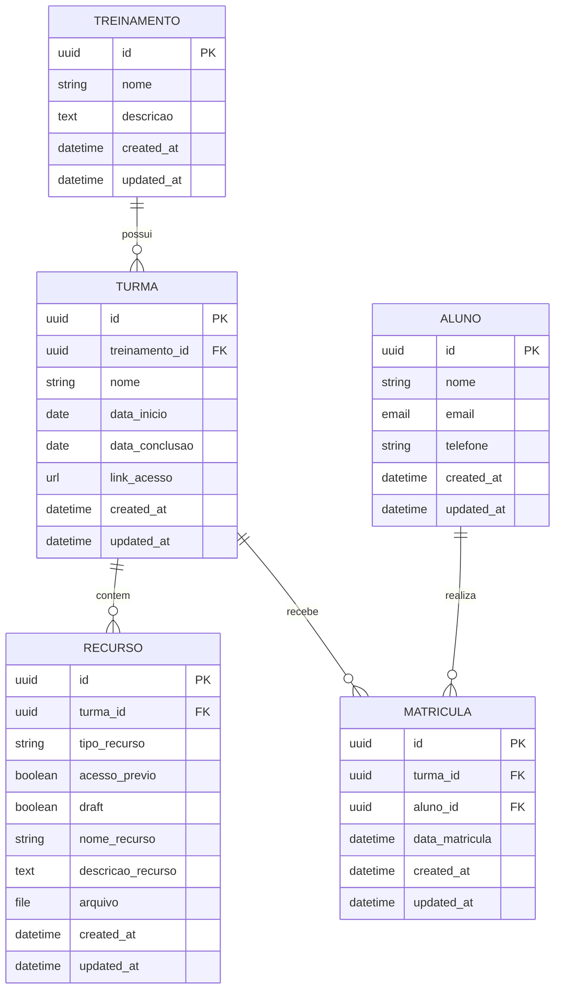

# Arquitetura Técnica - Sistema de Gestão de Sala de Aula StrataSec

## 1. Architecture design



## 2. Technology Description

- Frontend: React@18 + TypeScript + TailwindCSS@3 + Vite + React Router + Axios
- Backend: Django@4.2 + Django Rest Framework@3.14 + Python@3.10+
- Database: PostgreSQL@15 (produção) / SQLite (desenvolvimento)
- Authentication: Django Sessions + CSRF Protection
- File Storage: Django FileField com validação de tipos

## 3. Route definitions

| Route | Purpose |
|-------|---------|
| /login | Página de autenticação para administradores e alunos |
| /admin/dashboard | Dashboard administrativo com visão geral do sistema |
| /admin/treinamentos | Gestão completa de treinamentos (CRUD) |
| /admin/turmas | Gestão de turmas vinculadas aos treinamentos |
| /admin/recursos | Upload e configuração de recursos educacionais |
| /admin/alunos | Cadastro e manutenção de dados dos alunos |
| /admin/matriculas | Sistema de matrículas e vinculação aluno-turma |
| /aluno/dashboard | Painel do aluno com treinamentos matriculados |
| /aluno/turma/:id | Visualização detalhada da turma e recursos |
| /aluno/recurso/:id | Player de recursos com controles de acesso |

## 4. API definitions

### 4.1 Core API

**Autenticação**
```
POST /api/auth/login
```

Request:
| Param Name| Param Type  | isRequired  | Description |
|-----------|-------------|-------------|-------------|
| username  | string      | true        | Email ou nome de usuário |
| password  | string      | true        | Senha do usuário |

Response:
| Param Name| Param Type  | Description |
|-----------|-------------|-------------|
| success   | boolean     | Status da autenticação |
| user_type | string      | Tipo do usuário (admin/aluno) |
| redirect_url | string   | URL de redirecionamento |

**Gestão de Treinamentos**
```
GET /api/treinamentos/
POST /api/treinamentos/
PUT /api/treinamentos/{id}/
DELETE /api/treinamentos/{id}/
```

**Gestão de Turmas**
```
GET /api/turmas/
POST /api/turmas/
PUT /api/turmas/{id}/
DELETE /api/turmas/{id}/
GET /api/turmas/{id}/recursos/
```

**Gestão de Recursos**
```
GET /api/recursos/
POST /api/recursos/
PUT /api/recursos/{id}/
DELETE /api/recursos/{id}/
GET /api/recursos/{id}/download/
```

**Sistema de Matrículas**
```
GET /api/matriculas/
POST /api/matriculas/
DELETE /api/matriculas/{id}/
GET /api/aluno/matriculas/
```

## 5. Server architecture diagram



## 6. Data model

### 6.1 Data model definition



### 6.2 Data Definition Language

**Tabela de Treinamentos**
```sql
-- create table
CREATE TABLE treinamentos (
    id UUID PRIMARY KEY DEFAULT gen_random_uuid(),
    nome VARCHAR(200) NOT NULL,
    descricao TEXT,
    created_at TIMESTAMP WITH TIME ZONE DEFAULT NOW(),
    updated_at TIMESTAMP WITH TIME ZONE DEFAULT NOW()
);

-- create index
CREATE INDEX idx_treinamentos_nome ON treinamentos(nome);
```

**Tabela de Turmas**
```sql
-- create table
CREATE TABLE turmas (
    id UUID PRIMARY KEY DEFAULT gen_random_uuid(),
    treinamento_id UUID NOT NULL,
    nome VARCHAR(200) NOT NULL,
    data_inicio DATE NOT NULL,
    data_conclusao DATE NOT NULL,
    link_acesso URL,
    created_at TIMESTAMP WITH TIME ZONE DEFAULT NOW(),
    updated_at TIMESTAMP WITH TIME ZONE DEFAULT NOW(),
    CONSTRAINT fk_turma_treinamento FOREIGN KEY (treinamento_id) REFERENCES treinamentos(id) ON DELETE CASCADE
);

-- create index
CREATE INDEX idx_turmas_treinamento ON turmas(treinamento_id);
CREATE INDEX idx_turmas_data_inicio ON turmas(data_inicio);
```

**Tabela de Recursos**
```sql
-- create table
CREATE TABLE recursos (
    id UUID PRIMARY KEY DEFAULT gen_random_uuid(),
    turma_id UUID NOT NULL,
    tipo_recurso VARCHAR(20) NOT NULL CHECK (tipo_recurso IN ('video', 'arquivo_pdf', 'arquivo_zip')),
    acesso_previo BOOLEAN DEFAULT FALSE,
    draft BOOLEAN DEFAULT TRUE,
    nome_recurso VARCHAR(200) NOT NULL,
    descricao_recurso TEXT,
    arquivo VARCHAR(500),
    created_at TIMESTAMP WITH TIME ZONE DEFAULT NOW(),
    updated_at TIMESTAMP WITH TIME ZONE DEFAULT NOW(),
    CONSTRAINT fk_recurso_turma FOREIGN KEY (turma_id) REFERENCES turmas(id) ON DELETE CASCADE
);

-- create index
CREATE INDEX idx_recursos_turma ON recursos(turma_id);
CREATE INDEX idx_recursos_tipo ON recursos(tipo_recurso);
CREATE INDEX idx_recursos_acesso_previo ON recursos(acesso_previo);
CREATE INDEX idx_recursos_draft ON recursos(draft);
```

**Tabela de Alunos**
```sql
-- create table
CREATE TABLE alunos (
    id UUID PRIMARY KEY DEFAULT gen_random_uuid(),
    nome VARCHAR(200) NOT NULL,
    email VARCHAR(254) UNIQUE NOT NULL,
    telefone VARCHAR(20),
    created_at TIMESTAMP WITH TIME ZONE DEFAULT NOW(),
    updated_at TIMESTAMP WITH TIME ZONE DEFAULT NOW()
);

-- create index
CREATE INDEX idx_alunos_email ON alunos(email);
CREATE INDEX idx_alunos_nome ON alunos(nome);
```

**Tabela de Matrículas**
```sql
-- create table
CREATE TABLE matriculas (
    id UUID PRIMARY KEY DEFAULT gen_random_uuid(),
    turma_id UUID NOT NULL,
    aluno_id UUID NOT NULL,
    data_matricula TIMESTAMP WITH TIME ZONE DEFAULT NOW(),
    created_at TIMESTAMP WITH TIME ZONE DEFAULT NOW(),
    updated_at TIMESTAMP WITH TIME ZONE DEFAULT NOW(),
    CONSTRAINT fk_matricula_turma FOREIGN KEY (turma_id) REFERENCES turmas(id) ON DELETE CASCADE,
    CONSTRAINT fk_matricula_aluno FOREIGN KEY (aluno_id) REFERENCES alunos(id) ON DELETE CASCADE,
    CONSTRAINT unique_matricula UNIQUE (turma_id, aluno_id)
);

-- create index
CREATE INDEX idx_matriculas_turma ON matriculas(turma_id);
CREATE INDEX idx_matriculas_aluno ON matriculas(aluno_id);
CREATE INDEX idx_matriculas_data ON matriculas(data_matricula);
```

**Dados Iniciais**
```sql
-- Inserir treinamento de exemplo
INSERT INTO treinamentos (nome, descricao) VALUES 
('Segurança da Informação Básica', 'Curso introdutório sobre conceitos fundamentais de segurança da informação');

-- Inserir aluno de exemplo
INSERT INTO alunos (nome, email, telefone) VALUES 
('João Silva', 'joao.silva@email.com', '(11) 99999-9999');
```