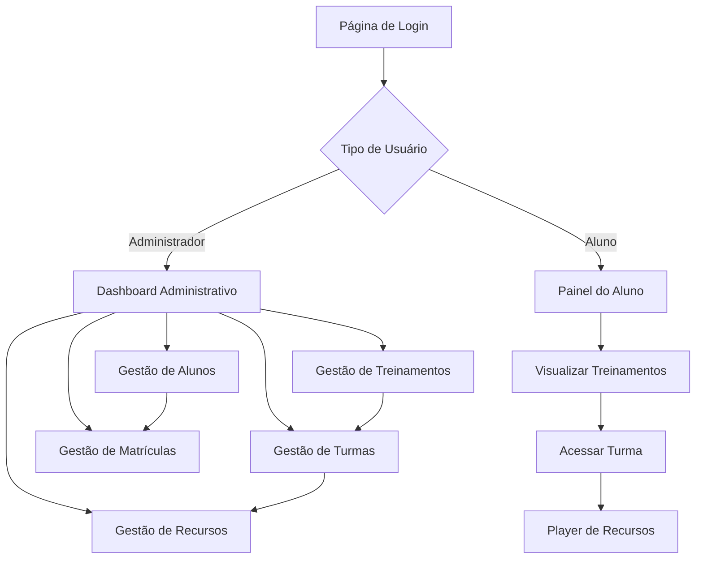

# Sistema de Gestão de Sala de Aula - StrataSec

## 1. Product Overview

Sistema web completo para gestão de treinamentos e turmas, permitindo que administradores gerenciem conteúdos educacionais e alunos acessem materiais de forma controlada e segura.

O sistema resolve a necessidade de organizar treinamentos corporativos, controlar acesso a recursos baseado em cronogramas e permissões, oferecendo uma experiência intuitiva tanto para gestores quanto para estudantes.

Destinado ao mercado de educação corporativa e treinamentos técnicos especializados.

## 2. Core Features

### 2.1 User Roles

| Role | Registration Method | Core Permissions |
|------|---------------------|------------------|
| Administrador | Criação manual pelo sistema | Gerenciar treinamentos, turmas, recursos, alunos e matrículas |
| Aluno | Cadastro por email ou importação | Visualizar treinamentos matriculados e acessar recursos permitidos |

### 2.2 Feature Module

Nosso sistema de gestão educacional consiste nas seguintes páginas principais:

1. **Página de Login**: autenticação de usuários, recuperação de senha, redirecionamento baseado em perfil.
2. **Dashboard Administrativo**: visão geral do sistema, estatísticas, navegação para módulos de gestão.
3. **Gestão de Treinamentos**: cadastro, edição, listagem e exclusão de treinamentos.
4. **Gestão de Turmas**: criação de turmas vinculadas a treinamentos, definição de datas e links de acesso.
5. **Gestão de Recursos**: upload e configuração de materiais (vídeos, PDFs, arquivos ZIP) com controles de acesso.
6. **Gestão de Alunos**: cadastro e manutenção de dados dos estudantes.
7. **Gestão de Matrículas**: vinculação de alunos às turmas.
8. **Painel do Aluno**: visualização de treinamentos matriculados e acesso a recursos.
9. **Player de Recursos**: reprodução de vídeos e download de materiais.

### 2.3 Page Details

| Page Name | Module Name | Feature description |
|-----------|-------------|---------------------|
| Página de Login | Sistema de Autenticação | Validar credenciais, redirecionar por perfil, recuperar senha, manter sessão segura |
| Dashboard Administrativo | Painel de Controle | Exibir estatísticas gerais, navegação rápida, resumo de atividades recentes |
| Gestão de Treinamentos | CRUD Treinamentos | Criar, listar, editar e excluir treinamentos com nome e descrição |
| Gestão de Turmas | CRUD Turmas | Gerenciar turmas vinculadas a treinamentos, definir datas de início/conclusão, configurar links de acesso |
| Gestão de Recursos | CRUD Recursos | Upload de arquivos, configurar tipo de recurso, definir acesso prévio e status de draft |
| Gestão de Alunos | CRUD Alunos | Cadastrar alunos com nome, email e telefone, editar dados, visualizar histórico |
| Gestão de Matrículas | Sistema de Matrículas | Vincular alunos às turmas, gerenciar inscrições, controlar acesso |
| Painel do Aluno | Interface do Estudante | Listar treinamentos matriculados, acessar turmas, visualizar recursos disponíveis |
| Player de Recursos | Reprodutor de Mídia | Reproduzir vídeos com controles, permitir download de materiais, validar permissões de acesso |

## 3. Core Process

**Fluxo do Administrador:**
1. Login no sistema com credenciais administrativas
2. Acesso ao dashboard com visão geral
3. Criação de treinamentos com nome e descrição
4. Configuração de turmas vinculadas aos treinamentos
5. Upload e configuração de recursos com regras de acesso
6. Cadastro de alunos no sistema
7. Realização de matrículas vinculando alunos às turmas

**Fluxo do Aluno:**
1. Login no sistema com credenciais de estudante
2. Visualização do painel com treinamentos matriculados
3. Acesso às turmas conforme cronograma estabelecido
4. Visualização de recursos disponíveis baseado em regras de negócio
5. Reprodução de vídeos e download de materiais permitidos

## 4. User Interface Design

### 4.1 Design Style

- **Cores Primárias**: Azul corporativo (#2563eb), Branco (#ffffff)
- **Cores Secundárias**: Cinza escuro (#374151), Verde sucesso (#10b981), Vermelho alerta (#ef4444)
- **Estilo de Botões**: Arredondados com sombra sutil, efeitos hover suaves
- **Fontes**: Inter ou Roboto, tamanhos 14px (corpo), 18px (títulos), 24px (cabeçalhos)
- **Layout**: Design card-based com navegação lateral fixa, espaçamento generoso
- **Ícones**: Lucide React ou Heroicons, estilo outline consistente

### 4.2 Page Design Overview

| Page Name | Module Name | UI Elements |
|-----------|-------------|-------------|
| Página de Login | Formulário de Autenticação | Card centralizado, campos com validação visual, botão principal destacado, link de recuperação |
| Dashboard Administrativo | Painel Principal | Menu lateral fixo, cards de estatísticas, tabela de atividades recentes, cores de status |
| Gestão de Treinamentos | Interface CRUD | Tabela responsiva, botões de ação coloridos, modal de edição, filtros de busca |
| Gestão de Turmas | Interface CRUD | Formulário com seleção de treinamento, campos de data estilizados, validação em tempo real |
| Gestão de Recursos | Upload e Configuração | Área de drag-and-drop, toggles para configurações, preview de arquivos, indicadores de status |
| Painel do Aluno | Interface do Estudante | Cards de treinamento com progresso, layout em grid responsivo, cores de status de acesso |
| Player de Recursos | Reprodutor | Player de vídeo customizado, botões de download estilizados, informações do recurso em sidebar |

### 4.3 Responsiveness

Sistema desktop-first com adaptação completa para tablets e smartphones. Navegação lateral se transforma em menu hambúrguer em telas menores. Otimização para touch em dispositivos móveis com botões e áreas de toque adequadas.
