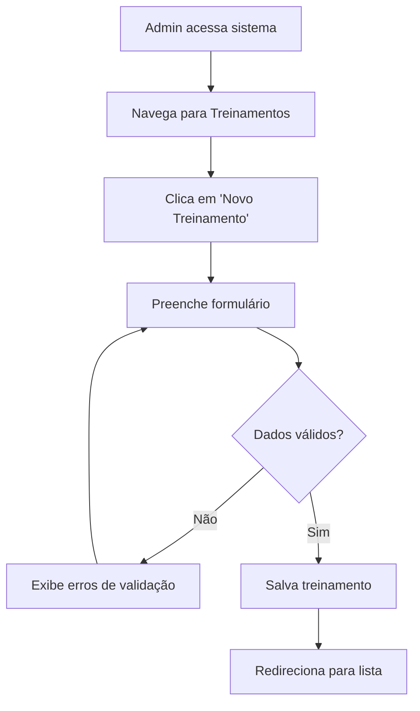
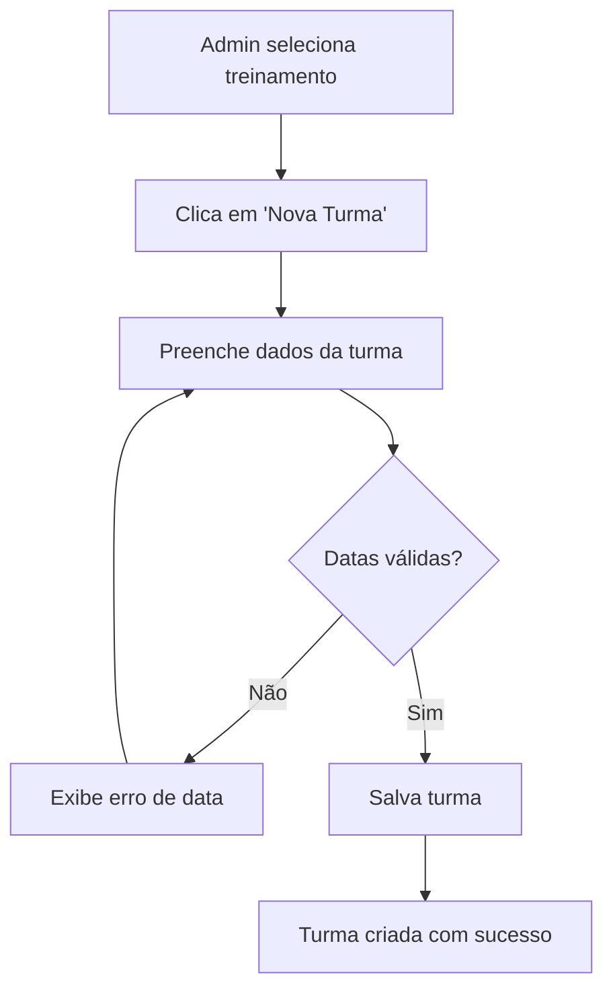
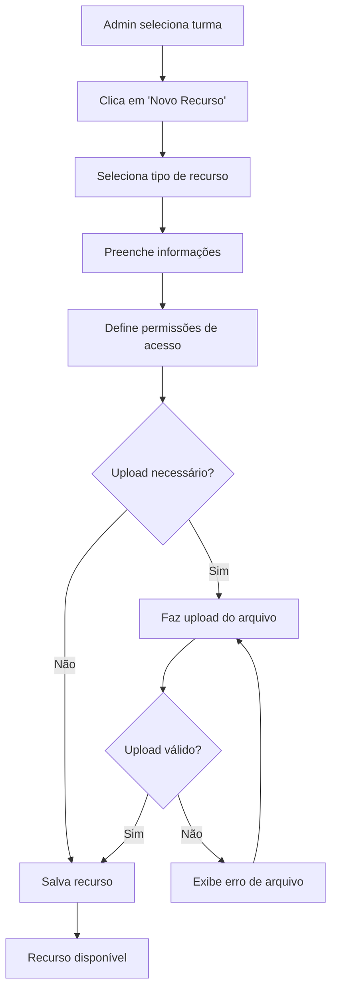
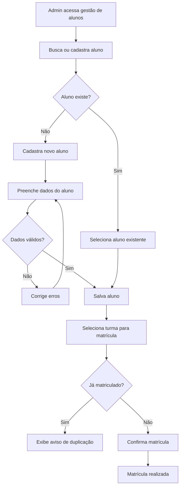

# 📚 FUNCIONALIDADES E REGRAS DE NEGÓCIO
## Sistema de Gestão de Sala de Aula

---

## 📋 ÍNDICE

1. [Visão Geral do Sistema](#-visão-geral-do-sistema)
2. [Perfis de Usuário](#-perfis-de-usuário)
3. [Fluxos de Cadastro](#-fluxos-de-cadastro)
4. [Regras de Negócio](#-regras-de-negócio)
5. [Funcionalidades por Tela](#-funcionalidades-por-tela)
6. [Casos de Uso](#-casos-de-uso)
7. [Validações e Restrições](#-validações-e-restrições)

---

## 🎯 VISÃO GERAL DO SISTEMA

O **Sistema de Gestão de Sala de Aula** é uma plataforma educacional que permite:

- **Administradores**: Gerenciar treinamentos, turmas, recursos e alunos
- **Alunos**: Acessar conteúdos educacionais de acordo com regras específicas
- **Sistema**: Controlar acesso baseado em datas e status dos recursos

### 🏗️ Arquitetura do Negócio

```
Treinamento (1) ──→ (N) Turma (1) ──→ (N) Recurso
                           │
                           └──→ (N) Matrícula ←── (1) Aluno
```

---

## 👥 PERFIS DE USUÁRIO

### 🔧 Administrador
**Responsabilidades:**
- Cadastrar e gerenciar treinamentos
- Criar e configurar turmas
- Adicionar recursos às turmas
- Matricular alunos nas turmas
- Monitorar acesso e progresso

**Permissões:** Isso não foi implementado, portanto, o acesso ao sistema é restrito apenas à área administrativa e à área do aluno.
- Acesso total ao sistema
- CRUD completo em todas as entidades
- Acesso ao painel administrativo Django
- Visualização de relatórios e estatísticas

### 🎓 Aluno
**Responsabilidades:**
- Acessar conteúdos das turmas matriculadas
- Visualizar recursos disponíveis
- Fazer download de materiais permitidos

**Permissões:**
- Acesso restrito às próprias turmas
- Visualização apenas de recursos liberados
- Download conforme regras de acesso

---

## 📝 FLUXOS DE CADASTRO

### 🔄 Fluxo 1: Cadastro de Treinamento



**Campos obrigatórios:**
- Nome do treinamento
- Descrição

**Validações:**
- Nome deve ter entre 3 e 200 caracteres
- Descrição não pode estar vazia
- Nome deve ser único no sistema

### 🔄 Fluxo 2: Cadastro de Turma



**Campos obrigatórios:**
- Treinamento (seleção)
- Nome da turma
- Data de início
- Data de conclusão
- Link de acesso (opcional)

**Validações:**
- Data de conclusão deve ser posterior à data de início
- Nome da turma deve ser único dentro do treinamento
- Link deve ter formato de URL válida (se preenchido)

### 🔄 Fluxo 3: Cadastro de Recurso



**Tipos de recurso:**
- **Vídeo**: MP4, AVI, MOV
- **Documento**: PDF, DOC, DOCX
- **Planilha**: XLS, XLSX
- **Apresentação**: PPT, PPTX
- **Arquivo**: ZIP, RAR
- **Link**: URL externa

**Configurações de acesso:**
- **Acesso Prévio**: Disponível antes do início da turma
- **Status Draft**: Oculto dos alunos até ser publicado

### 🔄 Fluxo 4: Matrícula de Aluno



**Dados do aluno:**
- Nome completo (obrigatório)
- E-mail (obrigatório, único)
- Telefone (opcional)

**Validações:**
- E-mail deve ter formato válido
- E-mail deve ser único no sistema
- Telefone deve ter formato brasileiro (se preenchido)
- Não permitir matrícula duplicada na mesma turma

---

## ⚖️ REGRAS DE NEGÓCIO

### 📅 RN001: Controle de Acesso por Data

**Antes do início da turma:**
- Alunos só podem acessar recursos marcados como "Acesso Prévio"
- Recursos em "Draft" nunca são visíveis

**Após o início da turma:**
- Alunos podem acessar todos os recursos não marcados como "Draft"
- Recursos com "Acesso Prévio" continuam disponíveis

**Implementação:**
```python
def pode_acessar_recurso(aluno, recurso):
    turma = recurso.turma
    hoje = timezone.now().date()
    
    # Verifica se está matriculado
    if not Matricula.objects.filter(aluno=aluno, turma=turma).exists():
        return False
    
    # Recursos em draft nunca são acessíveis
    if recurso.draft:
        return False
    
    # Antes do início da turma
    if hoje < turma.data_inicio:
        return recurso.acesso_previo
    
    # Após o início da turma
    return True
```

### 🔐 RN002: Segurança de Acesso

**Autenticação obrigatória:**
- Todos os endpoints requerem token JWT válido
- Tokens expiram em 60 minutos (configurável)

**Autorização por perfil:**
- Administradores: acesso total
- Alunos: acesso apenas às próprias turmas

**Proteção de arquivos:**
- URLs de download são temporárias
- Verificação de permissão antes do download

### 📊 RN003: Limites e Restrições

**Limites por turma:**
- Máximo de 50 alunos por turma (configurável)
- Sem limite de recursos por turma

**Limites de arquivo:**
- Tamanho máximo: 100MB por arquivo
- Tipos permitidos: PDF, DOC, DOCX, XLS, XLSX, PPT, PPTX, MP4, AVI, MOV, ZIP, RAR

**Performance:**
- Paginação obrigatória em listas com mais de 20 itens
- Cache de 5 minutos para dados de turmas e recursos

### 🔄 RN004: Estados e Transições

**Estados de uma turma:**
- **Planejada**: Antes da data de início
- **Em andamento**: Entre data de início e conclusão
- **Concluída**: Após a data de conclusão

**Estados de um recurso:**
- **Draft**: Não visível para alunos
- **Publicado**: Visível conforme regras de acesso
- **Arquivado**: Não mais disponível (futuro)

---

## 🖥️ FUNCIONALIDADES POR TELA

### 🏠 Dashboard Administrativo (`/dashboard`)

**Funcionalidades:**
- Visão geral do sistema
- Estatísticas de treinamentos, turmas e alunos
- Acesso rápido às principais funcionalidades
- Notificações e alertas

**Componentes:**
- Cards com contadores
- Gráficos de progresso
- Lista de turmas recentes
- Ações rápidas

**Permissões:**
- Apenas administradores

### 👥 Gestão de Usuários (`/dashboard/users`)

**Funcionalidades:**
- Listar todos os usuários do sistema
- Filtrar por tipo (admin/aluno)
- Buscar por nome ou e-mail
- Criar novos usuários
- Editar dados de usuários
- Desativar/ativar usuários

**Ações disponíveis:**
- **Criar**: Formulário com validação
- **Editar**: Atualização de dados
- **Visualizar**: Detalhes completos
- **Desativar**: Soft delete

**Validações:**
- E-mail único no sistema
- Senha forte (8+ caracteres, maiúscula, minúscula, número)
- Confirmação de senha

### 📚 Gestão de Treinamentos (`/dashboard/trainings`)

**Funcionalidades:**
- Listar treinamentos cadastrados
- Criar novos treinamentos
- Editar treinamentos existentes
- Visualizar turmas de cada treinamento
- Excluir treinamentos (se sem turmas)

**Informações exibidas:**
- Nome e descrição
- Número de turmas
- Total de alunos matriculados
- Data de criação

### 🎓 Gestão de Turmas (`/dashboard/classes`)

**Funcionalidades:**
- Listar turmas por treinamento
- Criar novas turmas
- Editar configurações de turmas
- Gerenciar matrículas
- Adicionar/remover recursos
- Visualizar progresso dos alunos

**Detalhes da turma:**
- Informações básicas
- Lista de alunos matriculados
- Recursos disponíveis
- Estatísticas de acesso

### 📁 Gestão de Recursos (`/dashboard/resources`)

**Funcionalidades:**
- Listar recursos por turma
- Upload de novos arquivos
- Editar metadados de recursos
- Configurar permissões de acesso
- Visualizar estatísticas de download
- Gerenciar status (draft/publicado)

**Tipos de recurso suportados:**
- **Vídeos**: Player integrado, download opcional
- **Documentos**: Visualização inline, download
- **Links**: Redirecionamento externo
- **Arquivos**: Download direto

### 🎓 Área do Aluno (`/area-aluno`)

**Funcionalidades:**
- Visualizar turmas matriculadas
- Acessar recursos disponíveis
- Fazer download de materiais
- Visualizar progresso pessoal
- Atualizar dados do perfil

**Informações exibidas:**
- Turmas ativas e concluídas
- Recursos por turma (conforme regras)
- Progresso de conclusão
- Histórico de acessos

**Restrições:**
- Apenas recursos liberados pelas regras
- Não pode ver recursos em draft
- Não pode acessar turmas de outros alunos

---

## 🎭 CASOS DE USO

### 📖 UC001: Administrador Cria Novo Treinamento

**Ator:** Administrador  
**Pré-condições:** Usuário logado como administrador  
**Fluxo principal:**

1. Admin acessa dashboard
2. Clica em "Gestão de Treinamentos"
3. Clica em "Novo Treinamento"
4. Preenche nome e descrição
5. Clica em "Salvar"
6. Sistema valida dados
7. Sistema cria treinamento
8. Sistema redireciona para lista

**Fluxos alternativos:**
- **6a.** Dados inválidos: Sistema exibe erros, retorna ao passo 4
- **7a.** Erro no servidor: Sistema exibe mensagem de erro

**Pós-condições:** Treinamento criado e disponível para criação de turmas

### 📖 UC002: Aluno Acessa Recurso de Vídeo

**Ator:** Aluno  
**Pré-condições:** Aluno logado e matriculado em turma  
**Fluxo principal:**

1. Aluno acessa área do aluno
2. Seleciona turma desejada
3. Visualiza lista de recursos
4. Clica em recurso de vídeo
5. Sistema verifica permissões
6. Sistema carrega player de vídeo
7. Aluno assiste ao conteúdo

**Fluxos alternativos:**
- **5a.** Sem permissão: Sistema exibe mensagem de acesso negado
- **5b.** Recurso em draft: Recurso não aparece na lista
- **6a.** Erro no carregamento: Sistema exibe mensagem de erro

**Pós-condições:** Acesso registrado no sistema para estatísticas

### 📖 UC003: Administrador Matricula Aluno em Turma

**Ator:** Administrador  
**Pré-condições:** Turma criada, aluno cadastrado  
**Fluxo principal:**

1. Admin acessa gestão de turmas
2. Seleciona turma desejada
3. Clica em "Gerenciar Matrículas"
4. Busca aluno por nome ou e-mail
5. Seleciona aluno da lista
6. Clica em "Matricular"
7. Sistema verifica se já está matriculado
8. Sistema cria matrícula
9. Sistema confirma operação

**Fluxos alternativos:**
- **7a.** Já matriculado: Sistema exibe aviso, não cria duplicata
- **8a.** Turma lotada: Sistema exibe erro de limite excedido

**Pós-condições:** Aluno pode acessar recursos da turma

---

## ✅ VALIDAÇÕES E RESTRIÇÕES

### 📋 Validações de Formulário

**Treinamento:**
```javascript
const validationRules = {
  nome: {
    required: true,
    minLength: 3,
    maxLength: 200,
    unique: true
  },
  descricao: {
    required: true,
    minLength: 10
  }
}
```

**Turma:**
```javascript
const validationRules = {
  nome: {
    required: true,
    minLength: 3,
    maxLength: 100,
    uniqueInTraining: true
  },
  dataInicio: {
    required: true,
    type: 'date',
    futureDate: false
  },
  dataConclusao: {
    required: true,
    type: 'date',
    afterStartDate: true
  },
  linkAcesso: {
    required: false,
    type: 'url'
  }
}
```

**Aluno:**
```javascript
const validationRules = {
  nome: {
    required: true,
    minLength: 3,
    maxLength: 150
  },
  email: {
    required: true,
    type: 'email',
    unique: true
  },
  telefone: {
    required: false,
    pattern: /^\(\d{2}\)\s\d{4,5}-\d{4}$/
  }
}
```

### 🚫 Restrições de Sistema

**Limites operacionais:**
- Máximo 50 alunos por turma
- Máximo 100MB por arquivo
- Máximo 1000 recursos por turma
- Sessão expira em 60 minutos

**Restrições de acesso:**
- Alunos só veem próprias turmas
- Recursos draft invisíveis para alunos
- Downloads requerem autenticação
- URLs de arquivo são temporárias (24h)

**Restrições de dados:**
- E-mail deve ser único
- Não permitir matrícula duplicada
- Não excluir treinamento com turmas
- Não excluir turma com matrículas ativas

### 🔍 Validações de Negócio

**Controle de acesso a recursos:**
```python
def validar_acesso_recurso(request, recurso_id):
    recurso = get_object_or_404(Recurso, id=recurso_id)
    
    # Admin sempre pode acessar
    if request.user.is_admin:
        return True
    
    # Verifica matrícula
    matricula = Matricula.objects.filter(
        aluno=request.user.aluno,
        turma=recurso.turma
    ).first()
    
    if not matricula:
        raise PermissionDenied("Não matriculado na turma")
    
    # Aplica regras de negócio
    if not pode_acessar_recurso(request.user.aluno, recurso):
        raise PermissionDenied("Recurso não disponível")
    
    return True
```

**Validação de datas:**
```python
def validar_datas_turma(data_inicio, data_conclusao):
    if data_conclusao <= data_inicio:
        raise ValidationError(
            "Data de conclusão deve ser posterior ao início"
        )
    
    if data_inicio < timezone.now().date():
        warnings.warn(
            "Turma com data de início no passado"
        )
```

---

## 📊 MÉTRICAS E INDICADORES

### 📈 KPIs do Sistema alguns implementados outros não

**Engajamento:**
- Taxa de acesso aos recursos
- Tempo médio de permanência
- Recursos mais acessados
- Alunos mais ativos

**Operacionais:**
- Número de turmas ativas
- Total de alunos matriculados
- Recursos publicados vs. draft
- Taxa de conclusão de turmas

**Técnicos:**
- Tempo de resposta das APIs
- Taxa de erro nas requisições
- Uso de armazenamento
- Picos de acesso simultâneo

### 📊 Relatórios Disponíveis

**Para Administradores:**
- Relatório de matrículas por período
- Estatísticas de acesso por recurso
- Progresso dos alunos por turma
- Uso de armazenamento por tipo de arquivo
---

## 🔮 FUNCIONALIDADES FUTURAS

### 📱 Versão Mobile
- App nativo para iOS e Android
- Sincronização offline
- Notificações push
- Download para visualização offline

### 🎯 Gamificação
- Sistema de pontos
- Badges por conquistas
- Ranking de alunos
- Certificados digitais

### 📊 Analytics Avançado
- Dashboard de métricas em tempo real
- Relatórios personalizáveis
- Integração com Google Analytics
- Heatmaps de navegação

### 🤖 Inteligência Artificial
- Recomendação de conteúdo
- Chatbot para suporte
- Análise de sentimento
- Detecção de padrões de aprendizado

---


### 🔄 Ciclo de Atualizações

**Atualizações menores (patches):**
- Correções de bugs
- Melhorias de performance
- Ajustes de interface

**Atualizações maiores (releases):**
- Novas funcionalidades
- Mudanças na arquitetura
- Atualizações de segurança

**Cronograma sugerido:**
- Patches: Conforme necessário
- Releases menores: Mensais
- Releases maiores: Trimestrais

---

*Documento criado em 31 outubro de 2025*  
*Versão: 1.0*  
*Sistema de Gestão de Sala de Aula - Elias Moraes*